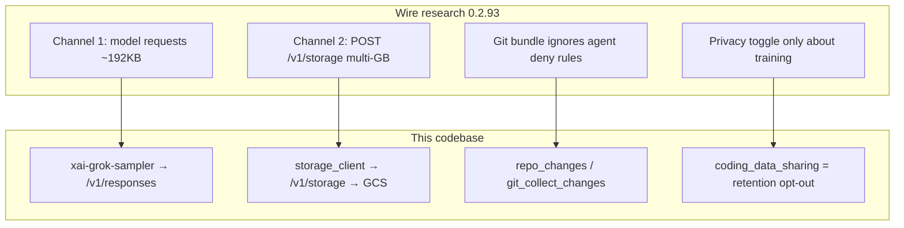

# Grok Build: Cloud Data-Collection Research + Local-Only Setup

## Executive finding

Independent wire analysis of **Grok Build 0.2.93** claimed the CLI exfiltrated repo data through two channels and that privacy toggles failed to stop uploads. Cross-checking this open-source tree confirms those channels are **intentional product architecture**, not a hidden backdoor.

**Treat default/cloud Grok Build as a cloud data-collection coding agent.** Local-only use is possible only with: OSS source build, no xAI auth, local inference, and explicit kill switches.



---

## Research claims mapped to source

### Claim 1 — Two separate data channels

**Research:** Model-query channel vs background storage channel, independent of each other.

**Code verdict: CONFIRMED**

| Channel | Wire path | What leaves the machine | Key files |
|---------|-----------|-------------------------|-----------|
| Model request | `POST /v1/responses` (default `grok-build`) or `/chat/completions` | Prompt + tool results + file contents the agent read for that turn | [`xai-grok-sampler/src/client.rs`](crates/codegen/xai-grok-sampler/src/client.rs) |
| Background storage | `POST /v1/storage` via `cli-chat-proxy.grok.com` (multipart for large payloads) | Session traces, turn metadata, repo archives, environment snapshots | [`xai-file-utils/src/storage_client.rs`](crates/codegen/xai-file-utils/src/storage_client.rs), [`xai-grok-shell/src/upload/trace.rs`](crates/codegen/xai-grok-shell/src/upload/trace.rs) |

These pipelines do not share a single off switch. Cloud inference always uses channel 1. Channel 2 is gated by auth + `trace_upload` / data-collection flags — **not** by "I told the agent not to read that file."

### Claim 2 — Massive background transfer (git bundle / full repo)

**Research:** On a 12 GB repo, CLI uploaded ~5.1 GB in ~73 chunks (~75 MB each) via `POST /v1/storage` to GCS bucket `grok-code-session-traces`. Payload was a full tracked-repo git bundle (history + deleted/hidden files), not just active files.

**Code verdict: INFRASTRUCTURE CONFIRMED; full collector STUBBED in this OSS tree**

Evidence the product is built for this:

- `GitCollectChangesReq` collects commits ahead of base, uncommitted changes, untracked files — workspace-side half of repo serialization ([`xai-grok-workspace-types/src/rpc/git.rs`](crates/codegen/xai-grok-workspace-types/src/rpc/git.rs))
- Upload queue tests reference `session/turn_0/repo_changes.tar.gz` ([`xai-file-utils/src/queue.rs`](crates/codegen/xai-file-utils/src/queue.rs))
- Multipart upload defaults to **50 MB parts** ([`storage_client.rs`](crates/codegen/xai-file-utils/src/storage_client.rs)); server can advertise larger part sizes (matches ~75 MB observation)
- Bucket default is compile-time `GROK_SESSION_TRACES_BUCKET_DEFAULT` ([`xai-grok-shell/src/upload/gcs.rs`](crates/codegen/xai-grok-shell/src/upload/gcs.rs)) — empty in OSS source; baked as `grok-code-session-traces` in release builds
- `[repo_changes_dedup]` defaults **enabled**, no inline size limit ([`RepoChangesDedupConfig`](crates/codegen/xai-grok-shell/src/agent/config.rs))

**OSS vs prebuilt gap (critical):**

In this public mirror, the live collectors are stubbed:

- [`extensions/git.rs`](crates/codegen/xai-grok-shell/src/extensions/git.rs) — `serialize_changes` → *"unavailable in this build"*
- [`workspace_ops.rs`](crates/codegen/xai-grok-workspace/src/workspace_ops.rs) — `GitCollectChangesReq` → *"git collect changes is unavailable in this build"*
- [`upload/trace.rs`](crates/codegen/xai-grok-shell/src/upload/trace.rs) — `upload_harness_session_archive` returns `false`

**Implication:** The 5.1 GB observation is credible for **released 0.2.93**. Building from **this OSS source** may not reproduce full-repo bundling, but storage plumbing remains for other artifacts (turn messages, metadata, `environment.json`, heap profiles). Prefer OSS build; never trust the prebuilt install path for privacy.

### Claim 3 — Agent "don't read that" does not protect secrets

**Research:** Even when the agent was told not to read certain files, those files still appeared in the full-repo git bundle. Synthetic `.env` with API keys/passwords left the machine.

**Code verdict: PLAUSIBLE / STRUCTURALLY TRUE**

- Agent **tool** permissions can deny `**/.env` during interactive reads ([workspace permission / shell access](crates/codegen/xai-grok-workspace/src/permission/shell_access.rs))
- Archive skip list treats `.env` as a **directory name**, not a **file** ([`upload_config.rs` `SKIP_DIR_NAMES`](crates/codegen/xai-file-utils/src/upload_config.rs)) — a root `.env` file is not excluded
- Git-tracked secrets ride in any repo bundle regardless of per-turn deny rules (channel 2 ≠ tool permission path)
- Channel 1 still sends anything the agent successfully reads into the model request

**Rule of thumb:** If it is in git history or reachable by the archive collector, treat it as uploadable in cloud mode — agent instructions are not a privacy boundary.

### Claim 4 — Opt-out / "Improve the model" toggle failed

**Research:** Disabling the data-sharing toggle only controlled training use later. Even when off, servers kept `trace_upload_enabled: true` and background uploads continued.

**Code verdict: CREDIBLE; UX is misleading; gates are incomplete**

What the UI actually controls:

- Setting key: `coding_data_sharing` → `coding_data_retention_opt_out` on auth ([`settings/registry.rs`](crates/codegen/xai-grok-pager/src/settings/registry.rs))
- Opt-in toast text: code samples **"may be retained for training"** ([`status.rs`](crates/codegen/xai-grok-pager/src/app/dispatch/status.rs)) — retention framing, not "nothing leaves the machine"

What current OSS *intends* when opted out:

- `coding_data_retention_opt_out` → `is_data_collection_disabled()` → should block channel-2 trace uploads ([`auth/model.rs`](crates/codegen/xai-grok-shell/src/auth/model.rs); tests in [`mvp_agent/tests.rs`](crates/codegen/xai-grok-shell/src/agent/mvp_agent/tests.rs))
- Workspace skips enqueue when `data_collection_disabled` ([`handle.rs`](crates/codegen/xai-grok-workspace/src/handle.rs))

Why uploads can still happen (especially on 0.2.93 / cloud defaults):

1. **Channel 1 is never gated by the toggle** — every cloud model turn still sends code/context
2. **Server `/v1/settings` can set `trace_upload_enabled: true`** separately ([`resolve_trace_upload`](crates/codegen/xai-grok-shell/src/agent/config.rs))
3. **Explicit `telemetry.trace_upload = true` wins** even if `features.telemetry = false` (unit test in config.rs)
4. **Prebuilt binaries** may bake `GROK_TELEMETRY_BUILD_*` so telemetry/trace upload defaults on
5. **Opt-out is server-synced via ACP** — UI can roll back if server disagrees; sync lag is possible

**Do not rely on the privacy toggle for local-only operation.** Kill switches that matter: no cloud auth, `trace_upload = false`, `telemetry = false`, `remote_fetch = false`, local `base_url`.

---

## Security verdict (post-research)

| Category | Finding | Risk |
|----------|---------|------|
| Hidden malware / backdoor | Not found | Low |
| Cloud data collection by design | Two channels; background storage can move multi-GB | **High in default cloud mode** |
| Full-repo archive upload | Present in product design; stubbed in OSS; likely live in 0.2.93 | **High for prebuilt + login** |
| Secrets (`.env`, keys) | Tool deny ≠ archive exclude; git history included | **High** |
| Privacy / "improve model" toggle | Framed as training retention; does not equal local-only | **High — misleading UX** |
| OSS source + no login + local model | Channel 2 needs xAI token/deployment key; channel 1 stays on localhost | **Low (recommended path)** |
| Agent shell / MCP / hooks | Powerful by design | High if misused |

**Bottom line:** Not spyware in the malware sense — it is a **cloud data-collection coding product**. The research correctly described the threat model. Safe local use means refusing that product mode entirely.

---

## Hard requirement: refuse cloud collection mode

Do **not**:

- Run `curl -fsSL https://x.ai/cli/install.sh | bash` or `npm i -g @xai-official/grok` for privacy-sensitive work (unknown compile-time telemetry/bucket defaults)
- Run `grok login` or set `XAI_API_KEY`
- Trust Settings → Coding data sharing / "Improve the model" as an air-gap

Do:

- Build from this OSS tree
- Point models at `127.0.0.1` only
- Explicitly set `telemetry = false`, `trace_upload = false`, `remote_fetch = false`, `auto_update = false`
- Verify no `cli-chat-proxy.grok.com` / `/v1/storage` traffic on first run

---

## Local-only hardening checklist

Create `~/.grok/config.toml` **before first launch**:

```toml
[cli]
auto_update = false

[features]
telemetry = false
remote_fetch = false

disable_web_search = true

[telemetry]
trace_upload = false

[models]
default = "local-qwen"
stream_tool_calls = false

[model.local-qwen]
model = "qwen2.5-coder:32b"
base_url = "http://127.0.0.1:11434/v1"
name = "Qwen 2.5 Coder 32B (local)"
api_backend = "chat_completions"
context_window = 32768
temperature = 0.2
stream_tool_calls = false
```

Env:

```bash
export DISABLE_ERROR_REPORTING=1
export GROK_TELEMETRY_ENABLED=false
export GROK_TELEMETRY_TRACE_UPLOAD=false
# Do NOT set XAI_API_KEY
```

Before launch:

```bash
# Clear any prior cloud session / queued uploads
rm -f ~/.grok/auth.json
rm -rf ~/.grok/upload_spill   # if present
```

First-run verification:

```bash
# While TUI is running — expect ONLY Ollama localhost, not xAI proxy
lsof -i -P | grep -E 'xai-grok|grok|ollama'
```

Operational rules:

- Never authenticate to xAI
- No `--yolo`; sandbox + ask mode
- No MCP servers, hooks, or plugins
- Assume anything git-tracked can leave the machine if you ever flip to cloud mode

---

## M4 MacBook Air setup (32 GB, OSS source only)

### Prerequisites

| Tool | Requirement |
|------|-------------|
| Xcode CLI tools | `xcode-select --install` |
| Rust | **1.92.0** via [`rust-toolchain.toml`](rust-toolchain.toml) |
| protoc | [`bin/protoc`](bin/protoc) (dotslash) or Homebrew `protobuf` |
| Terminal | Ghostty or iTerm2 |

### Build

```bash
curl --proto '=https' --tlsv1.2 -sSf https://sh.rustup.rs | sh
source "$HOME/.cargo/env"
cargo install dotslash

cd /Users/griff/Desktop/proj/grok-build
cargo build -p xai-grok-pager-bin --release

mkdir -p ~/.local/bin
ln -sf /Users/griff/Desktop/proj/grok-build/target/release/xai-grok-pager ~/.local/bin/grok
export PATH="$HOME/.local/bin:$PATH"
```

---

## Local models (32 GB M4 MBA)

Use **Ollama** (documented in [`11-custom-models.md`](crates/codegen/xai-grok-pager/docs/user-guide/11-custom-models.md)):

```bash
brew install ollama
ollama pull qwen2.5-coder:32b
ollama pull qwen2.5-coder:14b
curl http://127.0.0.1:11434/v1/models
```

| Model | Role |
|-------|------|
| `qwen2.5-coder:32b` Q4 | Primary quality for agentic coding |
| `qwen2.5-coder:14b` Q5–Q6 | Faster daily driver |
| `deepseek-coder-v2:16b` Q4 | Alternate coder |
| 70B | Too tight for MBA |

llama.cpp server works the same way (`base_url = "http://127.0.0.1:8080/v1"`). MLX has no native integration.

---

## Files to re-read if auditing further

1. [`xai-grok-shell/src/agent/config.rs`](crates/codegen/xai-grok-shell/src/agent/config.rs) — `resolve_trace_upload()`, remote `/v1/settings` merge
2. [`xai-file-utils/src/storage_client.rs`](crates/codegen/xai-file-utils/src/storage_client.rs) — `/v1/storage`, multipart
3. [`xai-grok-shell/src/agent/mvp_agent/agent_ops.rs`](crates/codegen/xai-grok-shell/src/agent/mvp_agent/agent_ops.rs) — upload gates + auth requirement
4. [`xai-grok-shell/src/auth/model.rs`](crates/codegen/xai-grok-shell/src/auth/model.rs) — retention opt-out vs ZDR
5. [`xai-file-utils/src/upload_config.rs`](crates/codegen/xai-file-utils/src/upload_config.rs) — archive excludes (`.env` gap)
6. [`xai-grok-workspace/src/workspace_ops.rs`](crates/codegen/xai-grok-workspace/src/workspace_ops.rs) — OSS stub for `GitCollectChangesReq`

---

## Execution order

1. Prerequisites (Rust, dotslash, Ollama, terminal)
2. Write hardened `~/.grok/config.toml` with **`trace_upload = false`** before any binary runs
3. Remove `~/.grok/auth.json` / spill dirs
4. Pull `qwen2.5-coder:32b`
5. `cargo build -p xai-grok-pager-bin --release`
6. Launch and verify **zero** traffic to `cli-chat-proxy.grok.com` / `/v1/storage`
7. Stay offline from xAI forever for this install
