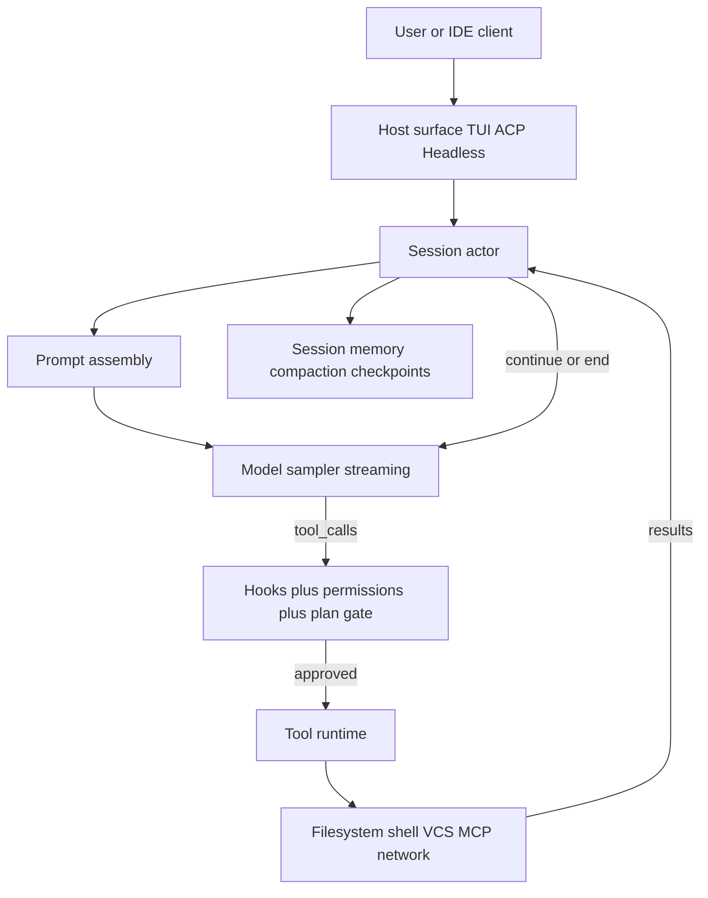

# Grok Build Agent Harness — Technical Breakdown

This is a design/architecture document (not an implementation plan). After you approve it, the same content can be rendered as a browsable Canvas artifact beside chat.

---

## 1. What an agent harness is

A coding agent harness is the **non-model** machinery that turns an LLM into a reliable software engineer. The model proposes; the harness authorizes, executes, observes, and feeds results back until the turn ends.

**Minimal loop every harness must implement:**

1. Assemble system prompt + conversation + tool schemas
2. Call the model (streaming)
3. If text-only → end turn (or apply completion-requirement recovery)
4. If tool calls → authorize → execute (often concurrent) → append tool results → goto 2
5. Persist, compact, emit UI/protocol events throughout

**Layers that separate good harnesses from toy scripts:**

| Layer | Job |
|---|---|
| Host | TUI / ACP / `-p` headless / WebSocket |
| Session | One conversation, turn lifecycle, cancellation |
| Agent definition | Tools + prompt + permission mode |
| Sampler | HTTP streaming, retries, multi-API shapes |
| Tool runtime | Schema, dispatch, progress streams |
| Workspace | FS/VCS/checkpoints/sandbox boundary |
| Safety | Hooks, permission rules, OS sandbox |
| Persistence | Resume, rewind, compaction, memory |

Grok Build implements all of these in Rust, with ACP as the primary integration protocol.

---

## 2. How Grok Build is organized

From [README.md](README.md):

| Crate / path | Role |
|---|---|
| [`xai-grok-pager-bin`](crates/codegen/xai-grok-pager-bin) | Composition root → `xai-grok-pager` / `grok` binary |
| [`xai-grok-pager`](crates/codegen/xai-grok-pager) | Full-screen TUI (scrollback, prompt, modals) |
| [`xai-grok-shell`](crates/codegen/xai-grok-shell) | Agent runtime: ACP, sessions, auth, sampling glue |
| [`xai-grok-agent`](crates/codegen/xai-grok-agent) | Portable `Agent` + definition parsing + prompt assembly |
| [`xai-grok-tools`](crates/codegen/xai-grok-tools) | Concrete tools (bash, edit, grep, task, …) |
| [`xai-tool-runtime`](crates/common/xai-tool-runtime) | `Tool` trait, streaming, `ToolDispatch` |
| [`xai-grok-sampler`](crates/codegen/xai-grok-sampler) | Actor-based model streaming + retry |
| [`xai-grok-workspace`](crates/codegen/xai-grok-workspace) | Host FS, VCS, permissions, checkpoints, hub |
| [`xai-grok-mcp`](crates/codegen/xai-grok-mcp) / hooks / config / sandbox / memory | Extensibility & safety |

**Runtime surfaces (same session core, different hosts):**

- Interactive TUI (`grok`) — typically spawns/connects a **leader** process; TUI is an ACP client of `MvpAgent`
- Headless (`grok -p`) for CI/scripts
- ACP stdio / WebSocket (`grok agent stdio|serve|headless`) for IDEs

**Actor split (confirmed across exploration):** pager = UX; shell = agent OS; `SessionActor` = turn loop; `ChatStateActor` (`xai-chat-state`) = conversation history + `build_request`; `SamplerActor` = model I/O/retry; `ToolBridge` = live tool runtime.

---

## 3. Core types and ownership

### Agent ([`xai-grok-agent`](crates/codegen/xai-grok-agent/README.md))

`Agent` = definition + rendered system prompt + `Arc<ToolBridge>` + reminder/compaction policies + optional hosted tools.

Built by `AgentBuilder` from Markdown+YAML frontmatter (`.grok/agents/*.md`) or programmatically. Frontmatter controls `tools` / `disallowedTools`, `permissionMode`, skills, prompt mode (`extend` vs `full`), completion requirements, per-tool retry.

Built-ins: `grok-build` (default SWE agent), `browser-use`.

### Tool runtime ([`xai-tool-runtime`](crates/common/xai-tool-runtime/src/tool.rs))

- Typed `Tool` with `Args`/`Output` + JSON Schema
- `execute` returns stream: `[Progress*] Terminal(Result)`
- Type-erased as `ToolDyn` / `ArcTool` for registries
- `ToolFamily` allows multiple variants under one `ToolId` (concise / hashline schemes)

### ToolBridge + registry ([`bridge.rs`](crates/codegen/xai-grok-tools/src/bridge.rs), [`registry/types.rs`](crates/codegen/xai-grok-tools/src/registry/types.rs))

`ToolRegistryBuilder::new()` registers the full tool catalog (GrokBuild + Codex + OpenCode + memory + packs). Finalize → `FinalizedToolset` with Resources (terminal, template renderer, params). Session talks to tools only through `ToolBridge`.

Tools are namespaced at registration (`GrokBuild:read_file`) but exposed to the model under client-facing names (`read_file`), with optional overrides.

### Session actor ([`xai-grok-shell` … `acp_session_impl/`](crates/codegen/xai-grok-shell/src/session/acp_session_impl))

`SessionActor` owns the turn loop. Split across focused modules: `turn.rs`, `tool_calls.rs`, `tool_dispatch.rs`, `sampler_turn.rs`, `prompt_build.rs`, hooks, plan mode, goals, spawn/subagents, compaction, rewind.

`MvpAgent` is the ACP-facing multi-session leader: session map, auth, models catalog, prompt-intake locks so concurrent `session/prompt` RPCs enqueue in arrival order.

---

## 4. The turn loop (heart of the harness)

Entry: `SessionActor::handle_prompt` in [`turn.rs`](crates/codegen/xai-grok-shell/src/session/acp_session_impl/turn.rs).

**Per user prompt:**

1. Turn lifecycle hooks / telemetry (`TurnStarted`)
2. Slash-command / skill rewrite (or short-circuit builtins like `/goal`)
3. Push user message into chat state (+ optional persist barrier)
4. Inner loop: `process_conversation_turn_with_recovery` → `process_conversation_turn`
5. Optional **goal harness** continuation (inject directive and re-sample)
6. `TurnEnded` / Stop hooks / MaxTurns

**Inside `process_conversation_turn` (simplified):**

1. Auto-compact / model-switch compact if needed
2. Prepare tool definitions (`ToolBridge` + plan-mode filtering; may drop client `web_search` when backend search is on)
3. Build messages (system prompt, AGENTS.md reminders, skills, memory injection)
4. Stream sample via `xai-grok-sampler` → text/thought/tool_call events → ACP `session/update`
5. On tool calls → `execute_tool_calls`
6. Append tool results; loop until model stops calling tools (or cancel / max turns / completion recovery)

**Tool execution pipeline** ([`tool_calls.rs`](crates/codegen/xai-grok-shell/src/session/acp_session_impl/tool_calls.rs)):

1. For each call: `prepare_tool_call` (parse args, hooks, permissions, plan-mode edit gate)
2. Collect approved calls
3. Per-file write locks for concurrent same-path edits
4. Parallel dispatch via `FuturesUnordered` + `dispatch_tool` through workspace ops
5. Auth 401 retry with shared `OnceCell` recovery
6. Interruptible waits abort on mid-turn interjection
7. Emit ACP tool_call / tool_call_update; feed `prompt_text` (+ system reminders) back to chat

`ToolLoop` outcomes: `Continue`, permission reject, cancel, followup message, hook denied (non-terminal — reason fed back).

---

## 5. Feature-by-feature design review

### 5.1 Prompt assembly

- Base MiniJinja template (tool conventions, formatting, user_info) + agent body (`promptMode: extend`) or full override (`full` with `${{ tools.* }}`)
- Inject AGENTS.md / Claude.md walk (repo root → cwd), skills section, personas as system-reminders for subagents
- Dynamic tool names via `TemplateRenderer` / kind lookup so prompts stay correct when tools are renamed or disabled

**Build-your-own takeaway:** Treat prompt as a compiled artifact of (template + discovered project rules + available tools). Never hardcode tool names in persona text without a render step.

### 5.2 Sampling ([`xai-grok-sampler`](crates/codegen/xai-grok-sampler/src/lib.rs))

Layered API: raw HTTP stream → `SamplingEvent`s → `SamplerHandle` actor (concurrency, cancel, retry, doom-loop signals). Supports Chat Completions / Responses / Messages-shaped backends. Auth is pluggable (`BearerResolver`, header injectors, session-token refresh gates for first-party hosts vs BYOK).

**Takeaway:** Separate “bytes from API” from “session semantics.” Retries and cancel must be first-class; tool batches share one auth recovery.

### 5.3 Permissions and safety

Documented in [22-permissions-and-safety.md](crates/codegen/xai-grok-pager/docs/user-guide/22-permissions-and-safety.md). Ordered pipeline:

1. `PreToolUse` hooks (can deny; allow does not skip later checks; hooks fail open)
2. Config rules: deny > ask > allow (CLI, `.grok/config.toml`, Claude settings, managed config)
3. Remembered grants (per project)
4. Built-in read-only auto-approvals (tools + safe bash segment list)
5. Permission mode policy (`default` / `dontAsk` / `bypassPermissions` / `acceptEdits`)

Plus **plan-mode edit gate** (separate from permissions — even YOLO cannot edit non-plan files).

Plus **OS sandbox** ([18-sandbox.md](crates/codegen/xai-grok-pager/docs/user-guide/18-sandbox.md)): Landlock/Seatbelt profiles `workspace|read-only|strict|devbox`.

**Takeaway:** App-level policy ≠ kernel enforcement. For a real harness, implement both; segment bash chains carefully (`deny`/`ask` per segment vs `allow` on whole string — Grok’s asymmetry is intentional and easy to get wrong).

### 5.4 Plan mode

[19-plan-mode.md](crates/codegen/xai-grok-pager/docs/user-guide/19-plan-mode.md): explore → write `plan.md` in session dir → `exit_plan_mode` approval UI. Tools: `enter_plan_mode`, `exit_plan_mode`, `ask_user_question`. Edit gate in `plan_mode_edit_gate`.

### 5.5 Subagents / Task

[16-subagents.md](crates/codegen/xai-grok-pager/docs/user-guide/16-subagents.md): child sessions with own context; types `general-purpose`, `explore`, `plan`; personas as overlays. Tools: `task` / spawn, `get_task_output`, `wait_tasks`, `kill_task`. Parent gets summary. Capability modes restrict child toolsets. Same-workspace children can reuse parent LSP runtime.

**Takeaway:** Subagents are sessions, not threads. You need session storage nesting, result summarization, and tool allowlists per type.

### 5.6 Background tasks / monitor / scheduler

Bash can run `background: true`; monitor/scheduler tools + `/loop`. Await tools are interruptible on user interjection. Terminal backend lives outside the registry lock so cancel can kill foreground commands without deadlock (`ToolBridge` design comment).

### 5.7 MCP

External tools via MCP servers; discovered as `server__tool`. Also meta-tools `search_tool` / `use_tool` for progressive discovery. Init strategies: Blocking vs Progressive before first prompt. Permission rules use `MCPTool(...)`.

### 5.8 Hooks and plugins

Lifecycle scripts/HTTP for PreToolUse, PostToolUse, SessionStart, UserPromptSubmit, Stop, etc. Plugins bundle skills, agents, hooks, MCP. Marketplace install + trust model for project hooks.

### 5.9 Skills

`SKILL.md` packages discovered from `.grok/skills`, user dirs, Claude compat paths. Invoked via slash rewrite or skill tool; inject instructions into the turn.

### 5.10 Memory

Optional cross-session store under `~/.grok/memory/`; hybrid search; `/flush`, `/dream`; tools `memory_search` / `memory_get`. Auto-save on session end is metadata-only (no raw shell — secrets).

### 5.11 Compaction / context management

When context fills: summarize older turns, swap to compact system prompt, checkpoint under `compaction_checkpoints/`. Goal harness can drive multi-round continuation with token budgets.

### 5.12 Sessions / rewind / checkpoints

Layout under `~/.grok/sessions/<encoded-cwd>/<session-id>/`: `updates.jsonl` (ACP stream of record), `chat_history.jsonl`, `plan.json`, `rewind_points.jsonl`, signals, subagents/. Workspace hunk tracker supports undo of file edits.

### 5.13 Workspace

[`xai-grok-workspace`](crates/codegen/xai-grok-workspace): FS ops, git/jj, folder trust, worktrees, activity gauges, optional hub/daemon. Tools ultimately mutate the world through workspace ops so VCS/checkpoints stay consistent.

### 5.14 ACP host contract

[15-agent-mode.md](crates/codegen/xai-grok-pager/docs/user-guide/15-agent-mode.md): JSON-RPC session lifecycle + streaming updates + permission requests. Extensions under `x.ai/*` for FS, git, worktree, search, terminal, rewind, auth, telemetry. TUI is effectively an ACP client of the shell.

### 5.15 Auth and models

Browser OIDC / API key / external auth provider binary; `~/.grok/auth.json`. Multi-model catalog, BYOK endpoints, custom OpenAI-compatible bases. Per-turn session-token refresh gated so tokens never leak to third-party BYOK hosts.

### 5.16 Compatibility toolsets

Registry also registers **Codex** (`apply_patch`, …) and **OpenCode** tool packs and concise/hashline variants — same capabilities, different schemas/names for model/tooling compatibility. Agent profiles pick which names the model sees.

---

## 6. Tool inventory (design notes)

Registered in `ToolRegistryBuilder::new()` (~50 implementations across GrokBuild / Concise / Hashline / Codex / OpenCode packs). Registry IDs often differ from **model-facing** names (e.g. `run_terminal_cmd` → `run_terminal_command`, `task` → `spawn_subagent`) via agent `ToolConfig` renames. Presets include `grok-build`, `grok-build-concise`, `grok-build-plan`, `grok-build-hashline`, `codex`, `explore`, `plan`. MCP stays off the hot tool list via stable meta-tools `search_tool` / `use_tool` (KV-cache friendly).

| Tool | Purpose | Design notes |
|---|---|---|
| `bash` / `run_terminal_cmd` | Shell | Timeout, output byte cap, background, sandbox, permission segmenting; LocalTerminalActor + process-group kill |
| `read_file` | Read with line numbers | Read-only auto-approve; variants: concise, hashline, Codex |
| `search_replace` | Precise edit | Write locks; drives LSP diagnostics reminders; plan-file gate |
| `list_dir` | Directory listing | |
| `grep` | ripgrep | Path deny rules apply |
| `web_search` / `web_fetch` | Network info | Fetch domain allowlist + SSRF gates; can be hosted server-side |
| `todo_write` | Task list | Todo-gate can force completion hygiene |
| `task` → `spawn_subagent` + output/wait/kill | Subagents & bg tasks | Max nesting depth 1; interruptible waits |
| `enter_plan_mode` / `exit_plan_mode` | Plan workflow | Approval intercept |
| `ask_user_question` | Structured questions | |
| `lsp` | Language server | Hidden if unconfigured; shared across subagents |
| `monitor` / scheduler_* | Long-running loops | |
| `image_*` / video tools | Media gen | Optional product surface |
| `memory_*` | Cross-session memory | Feature-flagged |
| `search_tool` / `use_tool` | MCP discovery | Progressive tool loading |
| `update_goal` | Goal harness | Orchestrated completion |
| Codex / OpenCode packs | Compat schemas | Ports noted in THIRD_PARTY notices |

**Tool author contract:** implement `Tool` + `ToolMetadata` (kind, namespace, requires expr) → register → Resources for config → stream progress for long ops → return `ToolOutput` that maps to model text + ACP UI.

---

## 7. Building your own from scratch (recommended path)

Do **not** start with a TUI. Build inward-out:

### Phase A — Minimal viable harness (1–2 weeks of focused work)

1. Chat history + system prompt string
2. One model streaming client (Chat Completions tool_calls)
3. 4 tools: `read_file`, `grep`, `search_replace`, `bash`
4. Simple permission prompt (or always-approve behind a flag)
5. Loop until no tool calls; print results
6. Truncate tool outputs (hard byte/line caps)

### Phase B — Real session

1. Persist JSONL conversation
2. Cancel / Ctrl+C kills shell
3. Concurrent tool calls with per-file write mutex
4. Context compaction when tokens exceed N
5. Project rules file discovery (AGENTS.md)

### Phase C — Product harness

1. ACP or your own JSON-RPC host protocol
2. Permission rule engine (deny/ask/allow + modes)
3. Hooks (at least PreToolUse)
4. Subagent as nested session + summary tool
5. Plan mode (single writable plan file)
6. OS sandbox profile
7. MCP client
8. Skills as prompt packages

### Design principles proven by this codebase

- **Actor/session mailbox** for turns — avoids racey concurrent prompts
- **Type-erased tools at the boundary, typed inside** — schema from `schemars`
- **Progress streams** for UX without blocking the protocol
- **Separate policy layers**: hooks → rules → mode → sandbox
- **Plan mode outside permission YOLO**
- **Prompt rendering from live tool registry**
- **Tool results always become model-readable text** (even errors)
- **Fail closed on approval UX unknowns; fail open on hook crashes** (document that tradeoff)
- **Never put secrets in auto-memory**

### What makes Grok Build “large”

Most of the code is not the loop — it is: TUI polish, ACP extensions, auth edge cases, Claude/Codex/OpenCode compat, enterprise config, telemetry, worktrees, LSP, media tools, goal orchestration, and years of permission/sandbox edge cases. A greenfield harness can stay small if you freeze scope to Phase A/B first.

---

## 8. Key files to read next (deep dive order)

1. [`crates/common/xai-tool-runtime/src/tool.rs`](crates/common/xai-tool-runtime/src/tool.rs) — tool contract
2. [`crates/codegen/xai-grok-tools/src/registry/types.rs`](crates/codegen/xai-grok-tools/src/registry/types.rs) — registration catalog
3. [`crates/codegen/xai-grok-shell/src/session/acp_session_impl/turn.rs`](crates/codegen/xai-grok-shell/src/session/acp_session_impl/turn.rs) — prompt → sample loop
4. [`.../tool_calls.rs`](crates/codegen/xai-grok-shell/src/session/acp_session_impl/tool_calls.rs) — authorize + parallel execute
5. [`crates/codegen/xai-grok-agent/README.md`](crates/codegen/xai-grok-agent/README.md) — agent definitions
6. [`crates/codegen/xai-grok-sampler/src/lib.rs`](crates/codegen/xai-grok-sampler/src/lib.rs) — model I/O
7. User guide Tier 2–3 under [`docs/user-guide/`](crates/codegen/xai-grok-pager/docs/user-guide/) — product semantics matching the code

---

## Deliverable after approval

If you want this as a navigable IDE artifact (diagrams + tables), the next step is to write a Canvas at the workspace canvases path summarizing the same architecture. No code changes to the harness itself are implied by this request.