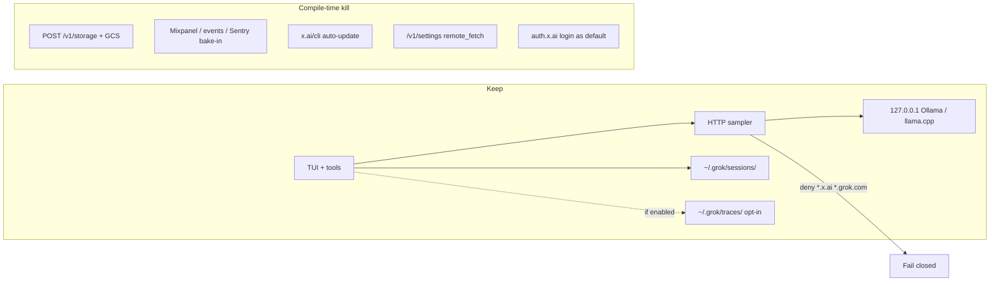

# Local-Only Hybrid Fork

## Progress (complete through PR7)

All hybrid-fork todos are implemented on stacked `local-only/*` branches. Open / merge PRs manually in order 1→7.

| Todo | Branch | Commit |
|------|--------|--------|
| feature-flag | `local-only/feature-flag` | `345448e` |
| endpoints-denylist | `local-only/endpoints-denylist` | `318d2c5` |
| kill-storage | `local-only/kill-storage` | `9f297bb` |
| kill-control-plane | `local-only/kill-control-plane` | `f571271` |
| local-traces | `local-only/local-traces` | `323c328` |
| regression-tests | `local-only/regression-tests` | `c8aa06e` |
| docs | `local-only/docs` | *(this commit)* |

Compare URLs (open PR after `gh auth login`):

- https://github.com/dgriff00/grok-build/pull/new/local-only/feature-flag
- https://github.com/dgriff00/grok-build/pull/new/local-only/endpoints-denylist
- https://github.com/dgriff00/grok-build/pull/new/local-only/kill-storage
- https://github.com/dgriff00/grok-build/pull/new/local-only/kill-control-plane
- https://github.com/dgriff00/grok-build/pull/new/local-only/local-traces

**Note:** Later branches include earlier commits (stacked). Prefer merge order 1→5 into `main`, or open PRs with base = previous branch.

## Decisions (locked)

- **Hardness:** Hybrid — compile-time kill for Channel 2 (storage), telemetry bake-in, auto-update, and remote settings that re-arm uploads; keep OpenAI-compatible HTTP for local models; **deny-list** `*.x.ai` / `*.grok.com` so Channel 1 cannot sneak back via a pasted `base_url`.
- **Logging:** Opt-in local turn traces under `~/.grok/traces/` (metadata + messages only). Never a default full-repo / git-bundle snapshot. Existing TUI session files under `~/.grok/sessions/` stay as-is.

Treat the researched cloud collection channels as **bugs** to eliminate, not features to configure.



---

## Feature flag

Add Cargo feature `local-only` and make it the **default** for this fork on the binary and shell crates.

Primary wiring:

- [`crates/codegen/xai-grok-pager-bin/Cargo.toml`](crates/codegen/xai-grok-pager-bin/Cargo.toml) — `default = [..., "local-only"]`, forward to shell/pager
- [`crates/codegen/xai-grok-shell/Cargo.toml`](crates/codegen/xai-grok-shell/Cargo.toml) — define `local-only`
- Propagate to [`xai-file-utils`](crates/codegen/xai-file-utils), [`xai-grok-telemetry`](crates/codegen/xai-grok-telemetry), [`xai-grok-update`](crates/codegen/xai-grok-update), [`xai-grok-env`](crates/codegen/xai-grok-env) as needed

Upstream-compatible builds can still set `--no-default-features` + re-enable cloud features later; this fork’s default binary is local-only.

---

## Phase 1 — Endpoint neuter + host deny-list

**Clear baked cloud defaults** under `local-only`:

- [`crates/codegen/xai-grok-env/src/lib.rs`](crates/codegen/xai-grok-env/src/lib.rs) — empty / unused production endpoint strings when `local-only`
- [`crates/codegen/xai-grok-shell/src/agent/config.rs`](crates/codegen/xai-grok-shell/src/agent/config.rs) — `CLI_CHAT_PROXY_BASE_URL_DEFAULT` and `XAI_API_BASE_URL_DEFAULT` become empty; `proxy_url()` / `resolve_inference_base_url()` must **not** fall back to cli-chat-proxy

**Inference rule:** With no `[model.*].base_url` / `GROK_MODELS_BASE_URL`, refuse to start a turn with a clear error (“configure a local model `base_url`”), never OAuth browser login.

**Host deny-list** (shared helper, e.g. in [`xai-grok-shell-base/src/util/mod.rs`](crates/codegen/xai-grok-shell-base/src/util/mod.rs) next to `is_cli_chat_proxy_url`):

- Reject URLs whose host is `x.ai`, `*.x.ai`, `grok.com`, `*.grok.com` (http/https/ws/wss)
- Enforce at: model `base_url` resolution, sampler client construction, web_search/web_fetch backends, any remaining proxy URL setters
- Error message names the blocked host so mis-pasted `https://api.x.ai/v1` fails closed

---

## Phase 2 — Compile-time kill Channel 2 (storage / uploads)

Under `local-only`:

| Surface | Change |
|---------|--------|
| [`xai-file-utils/src/storage_client.rs`](crates/codegen/xai-file-utils/src/storage_client.rs) | Upload / multipart / batch methods become no-ops that return a typed `LocalOnly` error (no HTTP) |
| [`xai-grok-shell/src/upload/`](crates/codegen/xai-grok-shell/src/upload/) | `spawn_trace_upload`, GCS helpers, queue workers that call proxy — stubbed / `cfg`-gated out |
| [`agent_ops.rs` `trace_upload_config*`](crates/codegen/xai-grok-shell/src/agent/mvp_agent/agent_ops.rs) | Always `None`; `resolve_trace_upload()` always `false` |
| Workspace upload queue | Never attach a remote `TraceExportSource`; spill reconcile **purge only** |
| Repo collectors | Keep / harden stubs: `serialize_changes` and `GitCollectChangesReq` stay unavailable ([`extensions/git.rs`](crates/codegen/xai-grok-shell/src/extensions/git.rs), [`workspace_ops.rs`](crates/codegen/xai-grok-workspace/src/workspace_ops.rs)) |

`is_data_collection_disabled()` effectively always true for remote purposes under `local-only` (or upload config never resolves).

---

## Phase 3 — Compile-time kill telemetry, auto-update, remote settings, cloud auth default

| Surface | Change under `local-only` |
|---------|---------------------------|
| Telemetry | [`xai-grok-telemetry`](crates/codegen/xai-grok-telemetry): ignore bake-in env (`GROK_TELEMETRY_BUILD_*`); never init Mixpanel/events/Sentry; `TelemetryMode::Disabled` forced |
| Trace upload flag | `resolve_trace_upload()` always false; ignore remote `trace_upload_enabled` |
| Remote fetch | `resolve_remote_fetch_enabled()` always false — no `/v1/settings` or `/v1/models` prefetch ([`features.rs`](crates/codegen/xai-grok-shell/src/util/config/resolve/features.rs)) |
| Managed config | Skip deployment-config fetch |
| Auto-update | [`xai-grok-update`](crates/codegen/xai-grok-update): checker no-op; `grok update` prints disabled; `auto_update` forced false |
| Auth | Skip browser OAuth / `auth.x.ai` as startup path; no requirement for `~/.grok/auth.json`; `grok login` prints “disabled in local-only build” |
| Feedback | No proxy submit; optional write to `~/.grok/feedback/` later (out of scope for v1 — disable remote only) |
| Cloud tools | Default off: web_search, voice STT, computer-hub / relay / gateway websockets to grok.com |

---

## Phase 4 — Opt-in local traces (replace GCS, not recreate the vacuum)

**Config** (new section in user config, default off):

```toml
[local_traces]
enabled = false
# turn metadata + messages only; no repo snapshot keys
max_bytes_per_session = 104857600
```

Also honor `GROK_LOCAL_TRACES=1` as env override to enable.

**Layout:**

```text
~/.grok/traces/<session_id>/
  turn_<n>/
    metadata.json    # PromptMetadata-shaped, local only
    messages.jsonl   # conversation items for that turn
```

**Implementation sketch:**

- New small module under shell, e.g. `crates/codegen/xai-grok-shell/src/upload/local_traces.rs`
- Hook at the same call sites that formerly enqueued cloud turn uploads (harness / post-turn path in [`agent_ops.rs`](crates/codegen/xai-grok-shell/src/agent/mvp_agent/agent_ops.rs) / upload turn helpers) — write files instead of `StorageClient`
- Enforce `max_bytes_per_session`; stop writing with a warning when exceeded
- **Explicit non-goals:** no `repo_changes.tar.gz`, no `git_collect_changes`, no environment-of-entire-disk dumps beyond what session jsonl already stores for the TUI

Keep [`~/.grok/sessions/`](crates/codegen/xai-grok-shell/src/session/persistence.rs) unchanged for TUI resume.

---

## Phase 5 — Regression tests (the “bugs stay fixed” suite)

Add tests that fail if cloud collection returns:

1. **No default cloud host** — empty user config never resolves to `cli-chat-proxy.grok.com` or `api.x.ai`
2. **Deny-list** — `base_url = "https://api.x.ai/v1"` and `https://cli-chat-proxy.grok.com/v1` are rejected
3. **Upload dead** — former storage entrypoints perform zero HTTP (mock listener gets 0 requests) under `local-only`
4. **Remote settings ignored** — even if a stub returns `trace_upload_enabled: true`, uploads stay off and `remote_fetch` stays false
5. **Local traces opt-in** — default: no `traces/` writes; with `enabled=true`, turn files appear under `GROK_HOME/traces/`
6. **No auth required** — agent completes a turn against a local OpenAI stub without `auth.json`
7. **Repo collector dead** — `GitCollectChangesReq` / `serialize_changes` remain unavailable

Prefer `GROK_HOME`-isolated unit/integration tests (pattern already used in shell tests).

---

## Phase 6 — Docs / DX

- Short **Local-only fork** section in root [`README.md`](README.md): build with defaults, sample `~/.grok/config.toml` for Ollama, how to enable `[local_traces]`, note that xAI cloud is unsupported in this build
- Update or add a pointer from the security review plan so the two docs don’t conflict

Example minimal user config (documented, not auto-written unless user asks at execute time):

```toml
[cli]
auto_update = false

[features]
telemetry = false
remote_fetch = false

[local_traces]
enabled = false

[models]
default = "local-qwen"

[model.local-qwen]
model = "qwen2.5-coder:32b"
base_url = "http://127.0.0.1:11434/v1"
api_backend = "chat_completions"
context_window = 32768
stream_tool_calls = false
```

---

## Implementation order

1. `local-only` feature flag + endpoint neuter + host deny-list (Phases 1) — stops accidental call-home
2. Storage/upload hard disable + spill purge-only (Phase 2) — fixes the research Channel 2 bug
3. Telemetry / update / remote_fetch / auth-default (Phase 3)
4. Opt-in local turn writer (Phase 4)
5. Regression tests (Phase 5)
6. README (Phase 6)

---

## Out of scope

- Reimplementing full-repo local archives
- Supporting dual-mode “sometimes use Grok cloud” in the default binary
- Rewriting the entire HTTP stack (sampler stays; destinations are constrained)
- Upstream PR to SpaceXAI (this is a fork policy; expect merge friction)